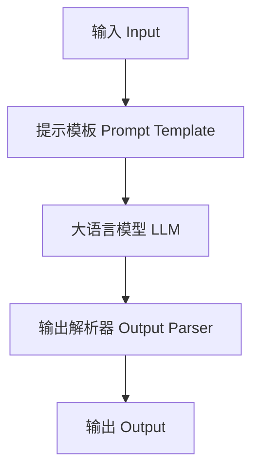
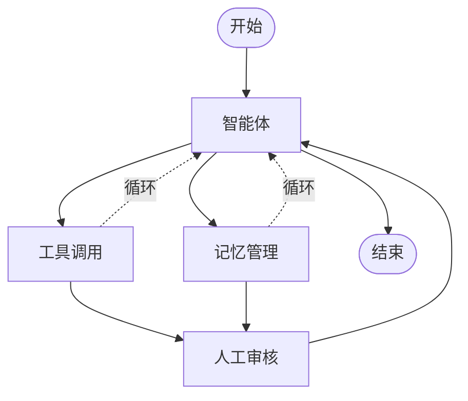
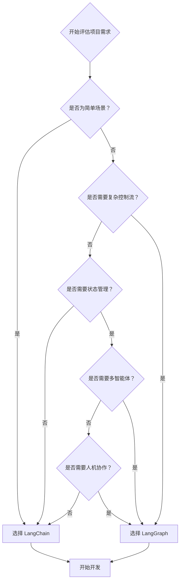

# LangGraph vs LangChain 详细对比分析

> 📅 创建日期: 2025-05-23  
> 🎯 目标: 全面分析 LangGraph 和 LangChain 的架构差异、功能特性和使用场景

## 📚 目录

- [概述](#概述)
- [LangGraph 简介](#langgraph-简介)
- [核心架构差异](#核心架构差异)
- [功能特性对比](#功能特性对比)
- [使用场景对比](#使用场景对比)
- [选择建议](#选择建议)
- [实践指南](#实践指南)

---

## 概述

LangGraph 和 LangChain 都是 LangChain 生态系统的重要组成部分，但它们服务于不同的用例和需求。本文档基于官方文档深入分析两者的区别，帮助开发者做出正确的技术选择。

### 核心差异总结

| 特性 | LangChain | LangGraph |
|------|----------|-----------|
| **架构模式** | 线性链式执行 | 图状态机架构 |
| **复杂度** | 简单直接 | 复杂可控 |
| **状态管理** | 基础状态传递 | 持久化状态管理 |
| **适用场景** | 简单问答、RAG | 复杂智能体、多智能体系统 |

---

## LangGraph 简介

### 什么是 LangGraph？

LangGraph 是一个专门用于构建 AI 智能体（Agent）和多智能体系统的开源框架，属于 LangChain 生态系统的一部分。

### 主要特性

#### 🎯 智能体构建平台
- 专门设计用于创建可靠、可扩展的 AI 智能体应用
- 提供完整的工具和组件来构建复杂的智能体系统
- 支持从开发到部署的完整解决方案

#### 📊 图状态管理
- **图结构建模**: 使用图（Graph）的形式来建模智能体的工作流
- **节点操作**: 每个节点（Node）代表一个操作或决策点
- **边缘定义**: 边（Edge）定义执行流程和条件路径
- **状态流转**: 支持复杂的状态管理和数据流转

#### 🔧 核心功能
- **工具调用支持**: 智能体可以调用外部工具和 API
- **内存管理**: 支持短期和长期记忆功能
- **人机协作**: 内置 Human-in-the-Loop 功能，允许人工干预
- **流式处理**: 支持实时数据流和响应
- **检查点机制**: 可以保存和恢复执行状态
- **时间旅行**: 可以回溯到之前的状态进行调试
- **多智能体架构**: 支持构建多个智能体协同工作的系统

---

## 核心架构差异

### 🔗 LangChain：线性链式架构



**特点：**
- ✅ 简单的线性执行流
- ✅ 适合直接的问答场景
- ✅ 较少的状态管理
- ✅ 快速原型开发
- ❌ 有限的控制流

### 📊 LangGraph：图状态机架构



**特点：**
- ✅ 复杂的状态管理
- ✅ 支持条件分支和循环
- ✅ 人机协作 (HIL)
- ✅ 多智能体协调
- ✅ 持久化和检查点
- ❌ 学习曲线较陡

---

## 功能特性对比

### 🏗️ 架构设计

| 功能特性 | LangChain | LangGraph |
|---------|----------|-----------|
| **执行模式** | 线性链式执行 | **图状态机执行** |
| **控制流** | 顺序执行，有限分支 | **复杂条件分支、循环、并行** |
| **状态管理** | 简单状态传递 | **持久化状态管理** |

### 🤖 智能体能力

| 功能特性 | LangChain | LangGraph |
|---------|----------|-----------|
| **智能体类型** | 简单反应式智能体 | **复杂多智能体系统** |
| **工具调用** | ✅ 基础支持 | ✅ 高级工具编排 |
| **决策能力** | 预定义逻辑 | **动态决策和路由** |

### 💾 记忆与持久化

| 功能特性 | LangChain | LangGraph |
|---------|----------|-----------|
| **对话记忆** | ⚠️ 基础支持 | ✅ 完整记忆管理 |
| **检查点机制** | ❌ 不支持 | ✅ 自动检查点 |
| **状态恢复** | ❌ 不支持 | ✅ 时间旅行功能 |

### 👥 人机协作

| 功能特性 | LangChain | LangGraph |
|---------|----------|-----------|
| **人工干预** | ❌ 不支持 | ✅ Human-in-the-Loop |
| **断点调试** | ❌ 不支持 | ✅ 动态断点 |
| **审核流程** | ❌ 不支持 | ✅ 内置审核节点 |

### 🚀 部署与扩展

| 功能特性 | LangChain | LangGraph |
|---------|----------|-----------|
| **流式处理** | ⚠️ 基础流式 | ✅ 多模式流式 |
| **并发处理** | ⚠️ 有限支持 | ✅ 原生并发支持 |
| **平台支持** | 自行部署 | **LangGraph Platform** |

---

## 使用场景对比

### 🎯 适用场景矩阵

#### LangChain 最佳场景
- ✅ **简单问答系统**
  - 聊天机器人
  - FAQ 系统
  - 客服助手

- ✅ **文档处理**
  - 文档总结
  - 内容摘要
  - 报告生成

- ✅ **基础 RAG 应用**
  - 知识检索
  - 文档问答
  - 信息查询

#### LangGraph 最佳场景
- ✅ **复杂智能体系统**
  - 多步骤推理
  - 决策树执行
  - 状态依赖任务

- ✅ **多智能体协作**
  - 任务分工
  - 协作决策
  - 分布式处理

- ✅ **工作流自动化**
  - 业务流程自动化
  - 审批流程
  - 人机协作工作流

- ✅ **高级 RAG 系统**
  - 智能路由
  - 多源检索
  - 动态策略调整

#### 重叠场景
- 🔄 **对话系统**: 两者都适用，选择取决于复杂度需求
- 🔄 **代码生成**: 简单生成用 LangChain，复杂多步骤用 LangGraph

---

## 选择建议

### 🤔 如何选择？

根据以下决策树来选择合适的框架：



### 📋 具体建议

#### 选择 LangChain 当你需要：
1. **快速原型**: 需要快速验证想法或构建 MVP
2. **简单场景**: 线性的问答、总结、翻译等任务
3. **学习曲线**: 团队对 LLM 应用开发经验有限
4. **资源限制**: 项目时间或人力资源有限

#### 选择 LangGraph 当你需要：
1. **复杂逻辑**: 多步骤推理、条件分支、循环执行
2. **状态管理**: 需要跨会话保持状态或实现记忆功能
3. **人机协作**: 需要人工审核、干预或决策
4. **生产部署**: 构建生产级的智能体应用
5. **可扩展性**: 系统需要支持复杂的扩展和定制

### 🔄 渐进式升级

**推荐路径：**
1. **起步阶段**: 使用 LangChain 快速验证概念
2. **功能扩展**: 当需求变复杂时，考虑迁移到 LangGraph
3. **混合使用**: 在同一项目中，简单部分用 LangChain，复杂部分用 LangGraph

---

## 实践指南

### 🚀 LangChain 快速开始

```python
from langchain.chains import LLMChain
from langchain.prompts import PromptTemplate
from langchain.llms import OpenAI

# 创建提示模板
prompt = PromptTemplate(
    input_variables=["question"],
    template="请回答以下问题: {question}"
)

# 创建链
llm = OpenAI()
chain = LLMChain(llm=llm, prompt=prompt)

# 执行
result = chain.run("什么是人工智能？")
```

### 🚀 LangGraph 快速开始

```python
from langgraph.graph import StateGraph
from typing import TypedDict

# 定义状态
class AgentState(TypedDict):
    messages: list
    current_step: str

# 定义节点
def agent_node(state):
    # 智能体逻辑
    return {"current_step": "processing"}

def tool_node(state):
    # 工具调用逻辑
    return {"current_step": "tool_called"}

# 创建图
workflow = StateGraph(AgentState)
workflow.add_node("agent", agent_node)
workflow.add_node("tools", tool_node)

# 添加边
workflow.add_edge("agent", "tools")
workflow.set_entry_point("agent")

# 编译并执行
app = workflow.compile()
result = app.invoke({"messages": ["Hello"], "current_step": "start"})
```

### 📈 性能考量

#### LangChain 性能特点
- ✅ **低延迟**: 简单链式执行，开销小
- ✅ **内存效率**: 状态管理简单，内存占用低
- ⚠️ **扩展性**: 复杂场景下性能下降明显

#### LangGraph 性能特点
- ⚠️ **启动开销**: 图编译和状态管理有额外开销
- ✅ **并发能力**: 原生支持并行执行，高并发性能好
- ✅ **可扩展性**: 为复杂场景优化，性能稳定

### 🔧 部署建议

#### LangChain 部署
- **简单部署**: 可以作为普通 Python 应用部署
- **Docker 容器**: 标准容器化部署
- **Serverless**: 适合 AWS Lambda、Azure Functions

#### LangGraph 部署
- **LangGraph Platform**: 官方托管平台（推荐）
- **自托管**: 使用 LangGraph Server
- **云部署**: 支持 Kubernetes、Docker Swarm

---

## 📚 参考资源

### 官方文档
- [LangChain 官方文档](https://python.langchain.com/)
- [LangGraph 官方文档](https://langchain-ai.github.io/langgraph/)
- [LangGraph GitHub 仓库](https://github.com/langchain-ai/langgraph)

### 学习资源
- [LangChain Academy](https://github.com/langchain-ai/langchain-academy)
- [LangGraph 教程](https://langchain-ai.github.io/langgraph/tutorials/)
- [LangGraph 模板应用](https://langchain-ai.github.io/langgraph/concepts/template_applications/)

### 社区资源
- [LangChain Discord](https://discord.gg/langchain)
- [GitHub Discussions](https://github.com/langchain-ai/langchain/discussions)

---

## 🤝 贡献

欢迎提交 Issue 和 Pull Request 来改进这份对比分析！

### 如何贡献
1. Fork 本仓库
2. 创建你的特性分支
3. 提交你的修改
4. 发起 Pull Request

---

## 📄 许可证

本项目采用 MIT 许可证 - 查看 [LICENSE](LICENSE) 文件了解详情。

---

## 🔖 版本历史

- **v1.0.0** (2025-05-23): 初始版本，基础对比分析
- 更多版本信息请查看 [Releases](../../releases)

---

<div align="center">

**⭐ 如果这份对比分析对你有帮助，请给个 Star！**

</div>